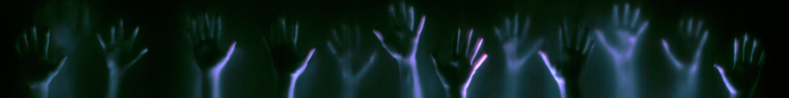
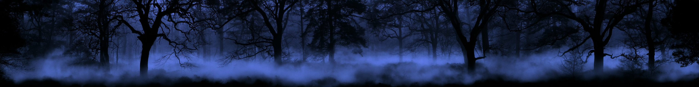
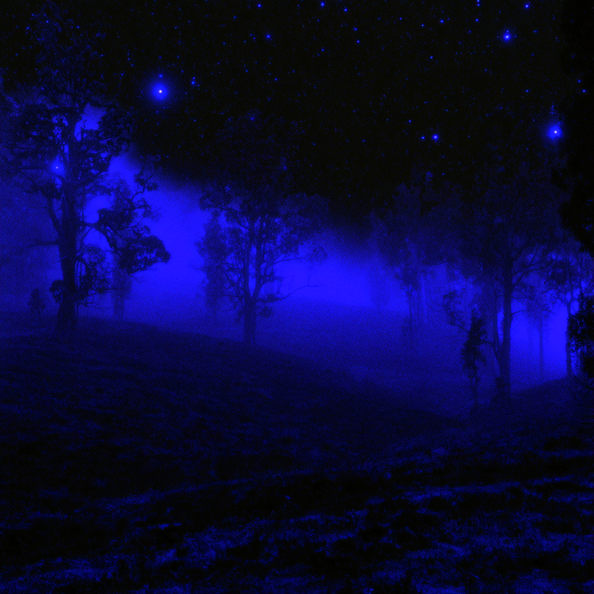

# Frosted Glass

A browser instrument that turns a webcam into a pane of fogged glass. Move behind it and your body becomes a shape in the fog, lit and scattered in real time, built for stage backdrops and for footage worth keeping. Everything runs inside the browser tab: no video is uploaded, and nothing is recorded unless you press record and save the take.

**Live:** https://sinaida-space.github.io/frosted-glass/

## How it looks

The pane obeys the optics of a real diffuser rather than a blur filter. Scattering widens with distance, so a palm pressed flat stays sharp and goes near-black while the body two steps behind it dissolves into milk.



Behind the glass sits a lit volumetric fog, rendered through a head-coupled off-axis frustum. Move your head and the fog shears, because the screen is being treated as a window with a real viewer position rather than as a flat picture.



Colour, density, light angle and glass distance are all live controls, so the same instrument covers a high-key white mortuary pane and a deep blue drowned one.

## Local Development

```bash
npm install
npm run dev
```

Open http://localhost:5173 in your browser.

## Build

```bash
npm run build
npm run preview
```

## Type Checking & Linting

```bash
npm run typecheck
npm run lint
```

## Shortcuts

Every shortcut also has a visible control in the on-screen panel.

| Key | Action |
|---|---|
| `F` | Toggle fullscreen |
| `H` | Hide or show the UI |
| `R` | Reset the glass to its defaults |
| `Space` | Force a shatter at screen centre |
| `C` | Start or stop recording |
| `P` | Open the projector popout |
| `1`–`5` | Load built-in preset 1–5 |
| `?` | Toggle this shortcut overlay |

## Presets

Five built-in looks, loadable with `1`–`5`:

| Preset | Look |
|---|---|
| Mortuary | High-key white, the reference look |
| Breath | Heavy condensation, warm light |
| Interrogation | Hard shafts, high contrast |
| Drowned | Deep cold fog, heavy scatter |
| Reliquary | Dim, grainy, near-black silhouette |

Any state can be saved as a named preset or copied as a share link that encodes every slider.

## Privacy

No account, no cookies, no video upload. The full breakdown, including what `localStorage` holds and which third parties the model files touch, is in the privacy panel reachable from the app’s footer.

Built by [Sinaida Krivchenko](https://sinaida.eu)

License: GPL-3.0
